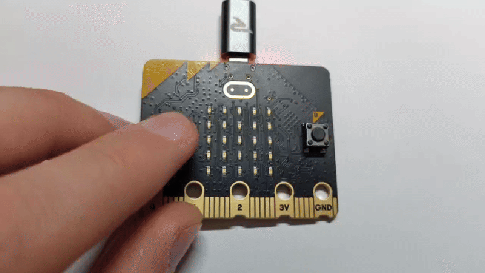
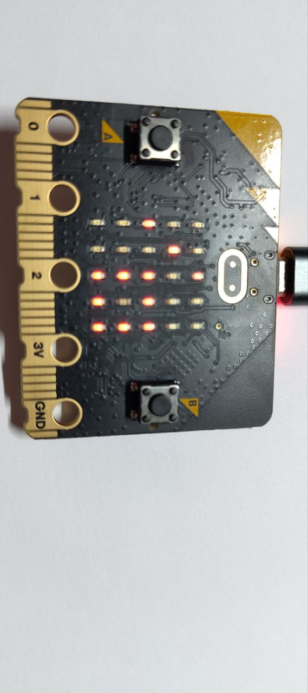
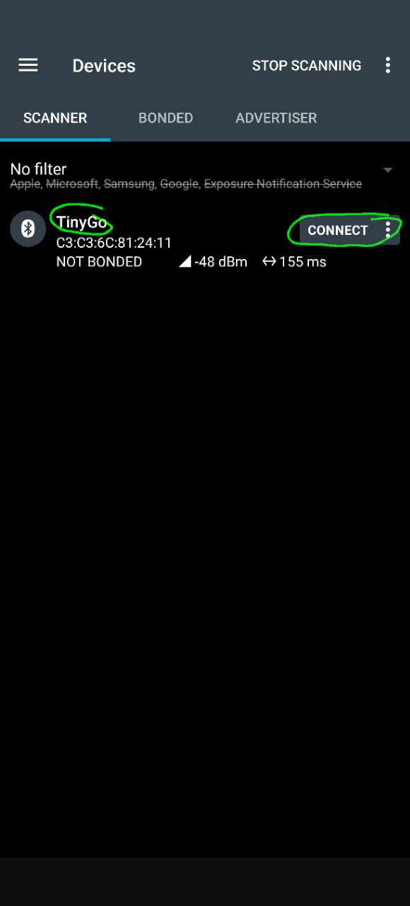
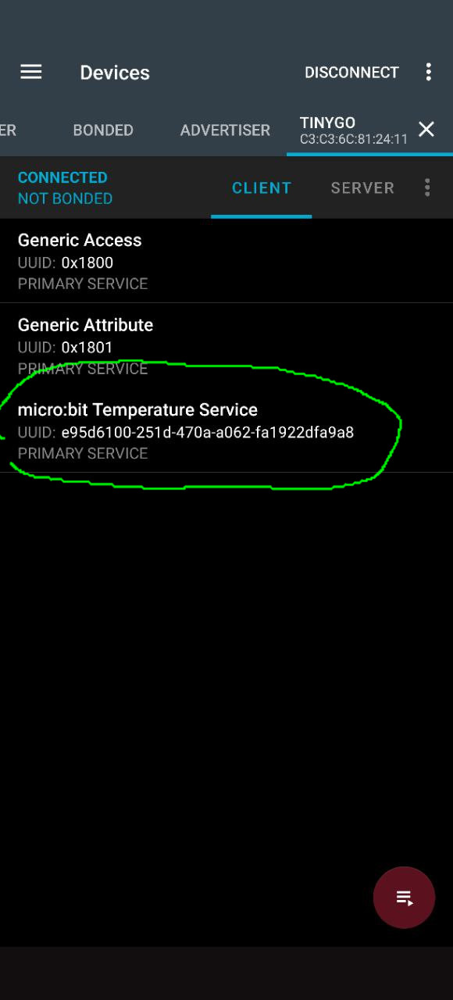
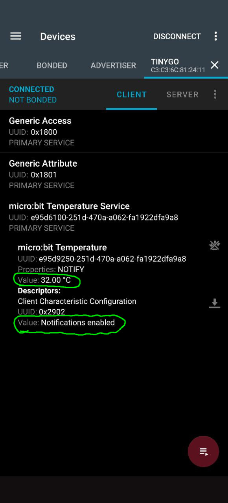
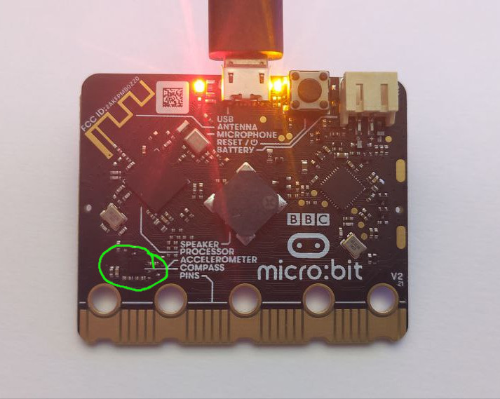

# Taller de BBC Microbit v2

Este es el repositorio para el taller con la BBC Microbit v2 y TinyGo

## Instalación de TinyGo

Las siguientes dependencias son necesarias.
Tanto para Go como para TinyGo utiliza la última versión disponible.

* Git
    * https://git-scm.com/downloads
    * No es necesario para Go, ni TinyGo, pero necesario para este taller
* Go
    * https://go.dev/dl/
        * guía de instalación : https://go.dev/doc/install
* TinyGo
    * https://github.com/tinygo-org/tinygo/releases/latest
        * guía de instalación : https://tinygo.org/getting-started/install/


Nota: hay una combinación entre Go y TinyGo. Basicamente TinyGo es compatible con las dos últimas y más recientes versiones de Go.

| TinyGo | Go compatible |
| ------ | ----------- |
| 0.35.0 | 1.23 - 1.22 |


Puedes comprobar que la instalación ha sido correcta o no con el siguiente comando

```
$ tinygo version
tinygo version 0.35.0 windows/amd64 (using go version go1.23.6 and LLVM version 18.1.2)
```

## Drivers de TinyGo

Todas las dependencias de código ya están incluidas en los módulos de Go de este proyecto, así que se descargarán e instalarán de manera automática. Solo para tu información, los drivers de Go te permiten conectarte a y utilizar diferentes sensores, pantallas y otros periféricos, el código puedes encontrarlo en el repositorio https://github.com/tinygo-org/drivers

## Ejecutando el código

Los programas de TinyGo se ejecutan directamente en el BBC Microbit, el proceso es el siguiente:

* Conecta el BBC Microbit al ordenador con un cable USB
* Modifica el programa de TinyGo
* Compila y flashea el programa al BBC Microbit con el commando ```tinygo flash --taget=microbit-v2 ./tutorial/stepX```
* El programa se ejecuta directamente en el BBC Microbit, puedes desconectarlo del ordenador y alimentarlo con una batería si quieres

¡Empecemos!

# Tutorial

## step1 - LED

El primer paso probará que puedes compilar y flashear el BBC Microbit con un programa de TinyGo, hará parpadear el primer LED de la matriz. 


Ejecuta el código con el siguiente comando:

```
tinygo flash --target=microbit-v2 ./tutorial/step1
```

Una vez que se ha flasheado correctamente, el LED de la esquina superior izquierda se encenderá de manera intermitente. Ahora estás preparado para continuar con el resto de ejemplo.

Nota: La matriz LED está conectada con una técnica llamada [charlieplexing](https://en.wikipedia.org/wiki/Charlieplexing) (o multiplexing) que permite conectar un gran número de LEDs con un reducido número de pines haciendo uso de la persistencia de visión. Ahondaremos en este más adelante.


## step2 - LED + button 

BBC Microbit tiene dos botones A (a la izquierda) y B (a la derecha). En este ejemplo cada vez que pulses el botón A se encenderá el LED de la esquina superior izquierda de la matriz.

Ejecuta el código con el siguiente comando:

```
tinygo flash --target=microbit-v2 ./tutorial/step2
```


## step3 - LEDs + button A + button B

En este ejemplo iluminaremos LEDs diferentes con cada botón.

Ejecuta el código con el siguiente comando:

```
tinygo flash --target=microbit-v2 ./tutorial/step3
```


## step4 - LED + button touch

BBC Microbit tiene un botón táctil (capacitativo), el logotipo dorado encima de la matriz. En este ejemplo cada vez que pulses el logotipo dorado se encenderá el LED de la esquina superior izquierda de la matriz. **El botón funciona regulín**.

Ejecuta el código con el siguiente comando:

```
tinygo flash --target=microbit-v2 ./tutorial/step4
```


## step5 - button A + buzzer

El bloque grande en el centro de la parte de atrás del BBC Microbit es un pequeño altavoz, en este ejemplo haremos uso de él y tocando un sonido cuando pulsemos el botón A. En este ejemplo vamos a usar un driver para controlar el altavoz, esto nos permite tener funciones específicas como ```.Tone(note, duration)``` en este ejemplo y no tener que lidiar a bajo nivel.
Ejecuta el código con el siguiente comando:

```
tinygo flash --target=microbit-v2 ./tutorial/step5
```



_¿esperabas sonido de un GIF?_


Ejercicios extra:
- Puedes hacer que toque una nota diferente con el botón B
- O que toque una melodía (varias notas seguidas)


## step6 - LED matrix

Como hemos comentado antes, la matriz LED está conectada con una técnica llamada [charlieplexing](https://en.wikipedia.org/wiki/Charlieplexing) que permite conectar un gran número de LEDs con un reducido número de pines haciendo uso de la persistencia de visión. En este caso volvemos a usar un driver para que sea más sencillo, además utilizaremos la interfaz ```Displayer``` con funciones como ```.SetPixel(x,y,color)```.

Ejecuta el código con el siguiente comando:

```
tinygo flash --target=microbit-v2 ./tutorial/step6
```


Ejercicios extra:
- Crea tu propio diseño para mostrar en la matriz

## step7 - Serial debug


Usemos USB CDC junto con ```print```, ```printf``` o ```println``` para debugar u otros propósitos.
USB CDC significa Universal Serial Bus Communications Device Class, y de forma simplificada es para comunicar un ordenador con un microcontrolador a través del cable USB.
Para ello podemos utilizar el flag ```--monitor``` en el comando ```tinygo flash``` o una vez flasheado el programa usar el comando ```tinygo monitor```

Ejecuta el código con el siguiente comando:

```
tinygo flash --target=microbit-v2 --monitor ./tutorial/step7
```

En la terminal aparecerán los mensajes: 

```
Hello Gophers! 1
Hello Gophers! 2
Hello Gophers! 3
Hello Gophers! 4
...
```


## step8 - Accelerometer, compass & temperature sensors

En este ejemplo volveremos a hacer uso de la comunicación USB CDC para ver en la terminal los valores del LSM303AGR. LSM303AGR es el acelerómetro y brújula digital que tiene el BB Microbit v2. 

Nota: Muchos sensores de este tipo también incluyen un sensor de temperatura para calibración interna de los valores reportados. Aunque no es su característica principal ni lo suelen indicar en el nombre, sirve como valor de referencia. Es mejor usar un sensor específica si se necesita mayor precisión en la temperatura.

Ejecuta el código con el siguiente comando:

```
tinygo flash --target=microbit-v2 --monitor ./tutorial/step8
```


Ejercicios extra:
- Crea un minijuego en el que se mueva un píxel por la matriz según la inclinación de la BBC Microbit usando el acelerómetro
- Crea una brújula digital usando un píxel que marque siempre el norte magnético

## step9 - Tinydraw

Tinydraw es un pequeño paquete que permite dibujar formas primitivas (lineas, triángulos, rectángulos, círculos) en cualquier pantalla que implemente la interfaz ```Displayer```.

Nota: al ser una pantalla de 5x5 no hay mucho espacio para dibujar y volverse creativo, pero inténtalo y muéstranos de qué eres capaz

Ejecuta el código con el siguiente comando:

```
tinygo flash --target=microbit-v2 ./tutorial/step9
```




## step10 - Tinyfont

Tinyfont es un pequeño paquete que permite escribir texto en cualquier pantalla que implemente la interfaz ```Displayer```.

Ejecuta el código con el siguiente comando:

```
tinygo flash --target=microbit-v2 ./tutorial/step10
```


Ejercicios extra:
- Utiliza otra fuente del paquete tinyfont, puedes encontrarlas en el repositorio: https://github.com/tinygo-org/tinyfont/

Nota: al ser una pantalla de 5x5 no hay mucho espacio y hay que utilizar las fuentes más pequeñas


## step11 - Bluetooth


Ejecuta el código con el siguiente comando, ¡OJO! en este caso el target es ligeramente diferente, usaremos **microbit-v2-s113v7** :

Para ejecutar este ejemplo, es posible que necesites instalar adicionalmente OPENOCD y ponerlo en el %PATH según tu sistema operativo: https://github.com/openocd-org/openocd/releases/tag/v0.12.0


```
tinygo flash --target=microbit-v2-s113v7 --programmer=cmsis-dap --monitor ./tutorial/step11
```

Necesitaremos una aplicación que se conecte al Microbit mediante BLE para ver la información que está enviando.
Podemos usar nRF Connect por ejemplo:
    - [Android](https://play.google.com/store/apps/details?id=no.nordicsemi.android.mcp&hl=en-US)
    - [Apple](https://apps.apple.com/us/app/nrf-connect-for-mobile/id1054362403)
    - [Desktop](https://www.nordicsemi.com/Products/Development-tools/nrf-connect-for-desktop/download)

Una vez instalada, puedes seguir estos pasos:

1- Conectate al microbit, se llama "TinyGo" si no lo cambiaste




2- Entra en el servicio de temperatura



3- Activa las notificaciones para que se actualice el valor



4- Pon el dedo en el acelerómetro/sensor de temperatura para ver como asciende la temperatura detectada


